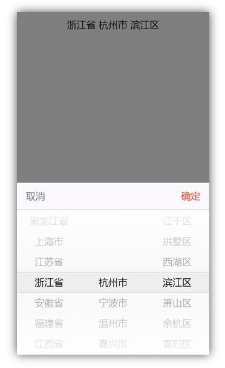

# vue-address-popup

仿 Vux 地址弹窗组件，基于 github.com/zynga/scroller 实现，体验：[luobotang.cn/vue-address-popup/](http://luobotang.cn/vue-address-popup/)



## 特性

- 良好的交互体验：基于 zynga/scroller 实现平滑滚动效果
- 准确的基础数据：基于[民政部2018年5月县以上行政区划数据](http://preview.www.mca.gov.cn/article/sj/xzqh/2018/201805/20180506280855.html)整理

## 使用

示例（demo.vue）：

```html
<template>
<div class="demo">
  <div class="demo-address" @click="onClickAddress">{{ address_desc.join(' ') }}</div>
  <address-popup :visible="popup_visible" :address="address" @confirm="onConfirm" @cancel="onCancel" />
</div>
</template>

<script>
import AddressPopup from 'vue-address-popup'

export default {
  data() {
    return {
      address: [],
      address_desc: [],
      popup_visible: false
    }
  },
  components: {
    AddressPopup
  },
  methods: {
    onClickAddress() {
      this.popup_visible = true
    },
    onConfirm({address, address_desc}) {
      this.address = address
      this.address_desc = address_desc
      this.popup_visible = false
    },
    onCancel() {
      this.popup_visible = false
    }
  }
}
</script>
```
